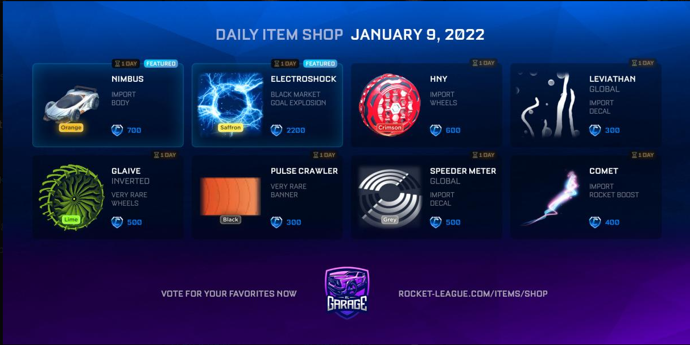
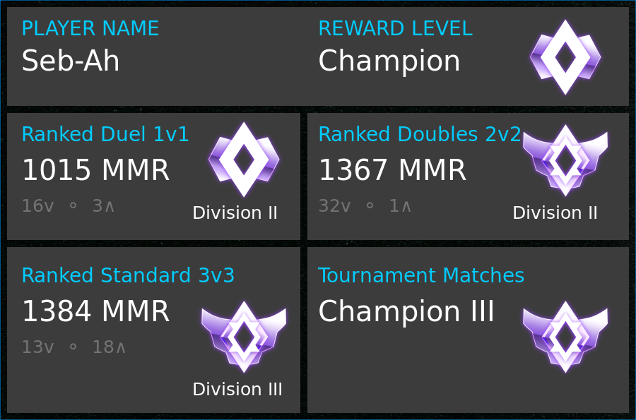

# discord.js-bot-commands

A list of commands that can be copy and pasted with minimal effort into a bot to run specific commands. For some commands you ill need to replace words with relevant data such as:
- roles
- channel ID
- minecraft rcon server

Node version = `12.22.3` \
`npm install` in directory with package.json \
`config.json` is for configuration of token and prefix

## Categories
### BASIC STUFF
	- ping and pong 
	- send website 
	- send help.txt 
	- send temperature of server 
### MANAGING SERVER
	- give user's a role when they join server
	- giver user's a role when they first send a message
	- delete a bulk of messages
	- Send embed of user's with a specific role
	- Factory reset a channel and kick all user's with specific role
### MINECRAFT SERVER
	- Start minecraft server
	- Stop minecraft server
### ROCKET LEAGUE
	- Rocket League item store (current date / specified date)
	- RL Tracker stats for a user
 
 

### PLAYING YOUTUBE AUDIO
	- play audio of youtube link
	- skip current video
	- clear queue
	- print queue
	- pause current song (buggy might not work)
### BOT SENDS CUSTOM MESSAGES
	- node ./selfrun.js
